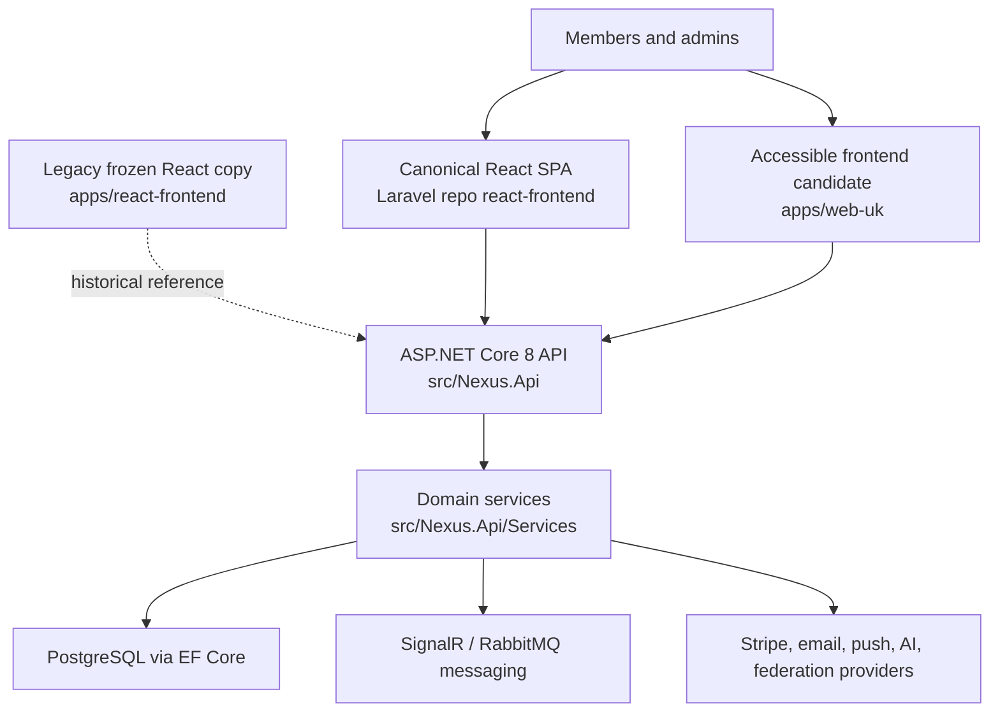

# Project NEXUS .NET Architecture

Last reviewed: 2026-07-05

This is the maintained architecture map for the ASP.NET Core implementation.
Laravel at `C:\platforms\htdocs\staging` remains the parity source of truth.

## System Shape

## Runtime Boundaries

| Surface | Primary path | Responsibility |
| --- | --- | --- |
| API | `src/Nexus.Api/Controllers`, `src/Nexus.Api/Program.cs` | JSON API, auth, tenant resolution, admin routes, health, Swagger. |
| Domain services | `src/Nexus.Api/Services` | Business rules, integrations, background-friendly operations. |
| Data model | `src/Nexus.Api/Entities`, `src/Nexus.Api/Data`, `src/Nexus.Api/Migrations` | EF entities, configurations, tenant-aware persistence, migrations. |
| Contracts | `src/Nexus.Contracts` | Shared DTOs/contracts where used outside API internals. |
| Messaging | `src/Nexus.Messaging`, `tests/Nexus.Messaging.Tests` | RabbitMQ publishing and messaging integration tests. |
| Canonical React frontend | `C:\platforms\htdocs\staging\react-frontend` | Production Laravel React frontend and source of truth for ASP.NET API compatibility. |
| Legacy React copy | `apps/react-frontend` | Frozen historical ASP.NET React fork. Do not modify unless explicitly approved. |
| Accessible frontend | `apps/web-uk` | .NET candidate for Laravel `accessible-frontend/` and `routes/govuk-alpha*` parity. |
| Standalone admin | `apps/admin` | Secondary admin surface, not the main Laravel parity target. |

## Source-Backed Inventory

Generated from source on 2026-07-05:

| Area | Count |
| --- | ---: |
| C# controllers | 216 |
| C# service files | 188 |
| EF entity files | 187 |
| EF migration classes excluding designers/snapshot | 89 |
| Static controller operations from `scripts/compare-laravel-api-parity.ps1` | 3,591 |
| Static EF/migration table names from `scripts/compare-laravel-schema-parity.ps1` | 316 |
| Static React routes from `scripts/compare-laravel-frontend-parity.ps1` | 462 |
| Static `apps/web-uk` routes from `scripts/compare-laravel-frontend-parity.ps1` | 136 |
| React locale directories | 7 |
| React locale namespaces from `scripts/compare-laravel-localization-parity.ps1` | 280 |
| C# test files | 248 |
| React admin TSX files | 302 |

The static controller operation count needs normalization through the parity
script and a future Swagger/OpenAPI export before being used as an API parity
score. The current static API report found 2,346 matched operations and 83
missing Laravel source operations.

The static table count needs alias triage before being used as a schema parity
score. The current schema report found 361 Laravel source tables, 316 .NET table
names, 126 exact matches, 235 missing Laravel-side names, and 190 .NET-only
names.

The static frontend route count is a historical route inventory only. The first
frontend report found 589 Laravel React routes versus 462 legacy .NET React
routes, with 393 matches and 196 missing Laravel-side React routes. Those React
counts no longer define the forward development target. The current target is
backend contract compatibility with the canonical Laravel React frontend. The
same report found 607 Laravel accessible routes versus 136 `apps/web-uk` routes,
with 53 matches and 554 missing Laravel-side accessible routes. That accessible
count is now historical: after the 2026-07-08 Web UK consolidation on `main`,
`apps/web-uk/docs/generated/accessible-route-matrix.*` reports 608 Laravel
accessible declarations, 612 local Web UK declarations, 608 exact matches, 0
missing Laravel routes, 2 extra local exchange workflow routes, and 3 ignored
infrastructure/helper routes.

The localization report scans all locale/namespace presence and scans English
keys by default. It found 11 Laravel locales versus 7 .NET locales, 605 Laravel
locale namespaces versus 280 .NET locale namespaces, and 4,942 missing English
keys in matched namespaces.

## Invariants

- All business data access must preserve tenant isolation.
- JWT auth, refresh tokens, admin policies, CORS, and FIDO2/WebAuthn rules are
  platform invariants, not optional parity details.
- PostgreSQL/EF migrations are the only schema-change path.
- Production changes require explicit user instruction and the production
  container guide.
- AGPL and NOTICE attribution must be preserved in source, UI, and packaging.
- `apps/react-frontend/` is frozen as a legacy React copy. Do not modify
  frontend files unless explicitly approved.
- ASP.NET backend routes must conform to the production Laravel React frontend
  contract, including `/api/v2` aliases, request/response envelopes, auth,
  tenant, upload, realtime config, and status-code behavior.

## Parity Boundary

Full parity includes API behavior, workflows, frontend routes, admin and
super-admin surfaces, accessible HTML behavior, integrations, queues/jobs,
localization, tenant settings, and operational documentation. Previous module
exclusions are now tracked gaps in `LARAVEL_PARITY_MAP.md`.
