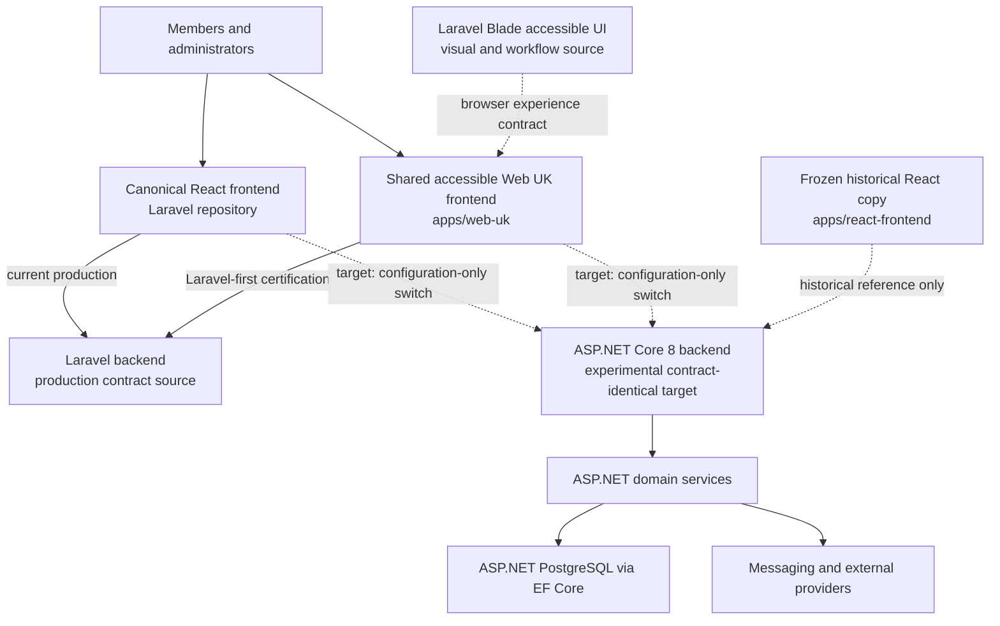

# Project NEXUS Contract-Identical Backend Architecture

Last reviewed: 2026-07-14

Status: **Maintained reference — canonical architecture; no current score**

This is the maintained product and runtime boundary map. Laravel at
`C:\platforms\htdocs\staging` is the production implementation and contract
source of truth. ASP.NET is an experimental second backend that must become
externally contract-identical for the same frontend consumers. See
[`decisions/ADR-0001-contract-identical-backends.md`](decisions/ADR-0001-contract-identical-backends.md).

## Two-Frontends-By-Two-Backends Model

The target is not a Laravel-like ASP.NET API or separate frontend forks. Both
unchanged frontends must ultimately run against either backend by configuration
only:

| Frontend | Laravel backend | ASP.NET backend |
| --- | --- | --- |
| Canonical React at `C:\platforms\htdocs\staging\react-frontend` | Production source-of-truth baseline | Same methods, paths, payloads, envelopes, statuses, auth, tenancy, side effects, and workflows; runtime-certified |
| Shared accessible Web UK at `apps/web-uk` | Laravel-first implementation and certification target | Same unchanged Web UK code and page flows; runtime-certified after backend contract parity |

Dashed frontend-to-ASP.NET edges are target certification gates, not a claim
that either combination is currently production-ready. Route representation is
only inventory evidence; it does not certify payload semantics, security,
persistence, providers, or workflows.

## Source-Of-Truth Boundaries

| Surface | Primary path | Responsibility |
| --- | --- | --- |
| Laravel backend | `C:\platforms\htdocs\staging` | Production behavior and API/workflow contract; read-only from this repository. |
| Canonical React frontend | `C:\platforms\htdocs\staging\react-frontend` | Production API consumer and call-site contract source; unchanged for ASP.NET contract-identity proof. |
| Laravel accessible UI/routes | `C:\platforms\htdocs\staging\accessible-frontend` and `routes/govuk-alpha*` | Browser experience, content, route, form, redirect, accessibility, and workflow source for Web UK; read-only. |
| ASP.NET API | `src/Nexus.Api/Controllers`, `src/Nexus.Api/Program.cs` | Laravel-contract-identical JSON API target, auth, tenant resolution, admin routes, health, and OpenAPI. |
| ASP.NET domain services | `src/Nexus.Api/Services` | Business rules, integrations, and background operations. |
| ASP.NET data model | `src/Nexus.Api/Entities`, `src/Nexus.Api/Data`, `src/Nexus.Api/Migrations` | Tenant-aware EF persistence and forward-only migrations. |
| Shared contracts | `src/Nexus.Contracts` | DTOs/contracts used outside API internals. |
| Messaging | `src/Nexus.Messaging`, `tests/Nexus.Messaging.Tests` | RabbitMQ publishing and messaging integration proof. |
| Shared accessible Web UK | `apps/web-uk` | Laravel-first accessible implementation; must remain backend-neutral. |
| Legacy React copy | `apps/react-frontend` | Frozen historical ASP.NET fork; do not modify without explicit approval. |
| Standalone admin | `apps/admin` | Secondary surface, not the canonical Laravel parity target. |

## Current-State Evidence

Fast-changing counts do not belong in this architecture document. Use these
canonical status sources:

- `CURRENT_ASPNET_CONTRACT_STATUS.md` for the current ASP.NET fixed-rubric score,
  evidence SHAs, published-but-unscored work, blockers, and next queue;
- `../apps/web-uk/docs/CURRENT_LARAVEL_FIRST_PARITY_STATUS.md` for the current
  accessible frontend score, route/API ledgers, certification boundary, and
  next queue;
- `FULL_PARITY_REMEDIATION_RUNBOOK.md` for the shared 1000-point rubric and
  end-to-end completion gate.

Historical controller, route, migration, schema, locale, and test counts remain
available in the dated parity maps and handoff histories. They must not be
presented as current without regenerating them at named Laravel and ASP.NET
SHAs.

## Invariants

- Laravel defines the contract; contract-identity failures are fixed in ASP.NET,
  not hidden by frontend backend-specific branches.
- Both canonical frontends remain unchanged when switching backend. Web UK may
  select an API origin/configuration, but must not fork templates, validation,
  redirects, content, or workflows by backend.
- All business data access preserves tenant isolation.
- JWT auth, refresh tokens, database-backed privilege, CORS, and
  FIDO2/WebAuthn rules are contract and security invariants.
- PostgreSQL/EF migrations are the only ASP.NET schema-change path.
- The ordinary local Laravel database is a confidential production-derived,
  read-only snapshot. Mutation, upload, download, and destructive certification
  require a separately provisioned, verified disposable Laravel environment.
- Production changes require explicit user instruction and prior review of
  `.claude/production-containers.md`.
- AGPL and NOTICE attribution must be preserved in source, UI, and packaging.

## What Completion Means

Full completion requires all four frontend/backend combinations in the table to
satisfy their declared gate. Static route equality alone is insufficient.
Methods and paths, aliases, request bodies, multipart fields, response
envelopes, pagination, validation/status behavior, auth and tenant behavior,
feature flags, persistence and side effects, uploads/downloads, realtime
configuration, jobs, providers, localization, security, and operational proof
must be contract-identical at the consumed boundary and runtime-certified.

The fixed scoring rules and exact acceptance evidence are maintained in
`FULL_PARITY_REMEDIATION_RUNBOOK.md`; current scores are maintained only in the
two workstream status documents above.
